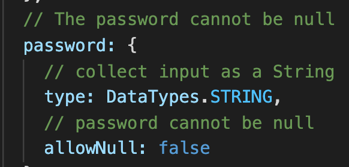
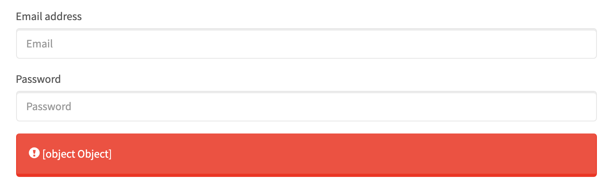

#  Code Tutorial

App Preview
 

    

## Introduction - UX Brief
This app walks the user through a sign up and login function, which, only after verified, leads the user to a member page. This markdown file will walk through the code to describe how all peices work in conjunction. We reccomend reading through this overview <b>before</b> inspecting the code; however, please familiarize yourself with the comments in the code if questions persist. 

## Table of Contents

* [Routes | Models ](#Server_Side)

* [Config](#config)

* [Errors](#errors)

_______

### Client Side Components -  HTML & JS 
<ol>
    <li>Sign Up</li>
    <li>Login</li>
    <li>Members</li>
</ol>

The codebase contains three HTML pages held in the public folder. These files hold the skeletal structure for different pages to be displayed to the user. Each page has a corresponding .js file that executes all required client side functions including listening for on(submit) functions that send api requests (POST & GET) to the server (example below). 

    

__________

### Server_Side  

#### Routes | Models 

Since this file structure follows the <u>MVC</u> paradigm, the use of routes and models are to be expected. The two routes.js files act the role of controller between the client and server. The route api-routes is listening to all api requests from the server and fulfilling those requests by connecting to the models/database and responding to the clients' specified requests (i.e. api/signup sends a POST request to add email and password info to the database). The html-routes.js file does the work of handling all html requests and renders the appropriate html page when requested via GET requests. 

Held in the models folder, the index.js file works as an intermediary between the server and the html routes that allows the html routes to change pages. The second file, the user.js, provides a model for a user that includes an email and password with specific validation requirements. 

    

#### Config

The components in the config file perform a variety of functions. The passport.js file communicates with the database to check whether or not the users' credentials are valid. If there are issues with the credentials, errors are thrown and login is denied; the user is then notified or prompted to re-submit their information. If their submission is correct (held in the database), they are then moved forward to the next page. 

The "isAuthenticated.js" file, held in the /config/middleware does the work of pushing the user forward if they are logged in, or returning them to the login page if they are not. Lastly, the config.json file is a .json file that communicates with the server to determine which host server/database to use (either held in "development" or in "production").
______

### Errors
If the user incorrectly inputs information, for either the login or signup page, they are responded with alerts or prompts. Some of which include:

1. Prompt if the email address is invalid format

    

2. If the user attempts to "Sign Up" when their account already exists they are provided the following error:

    

_________

